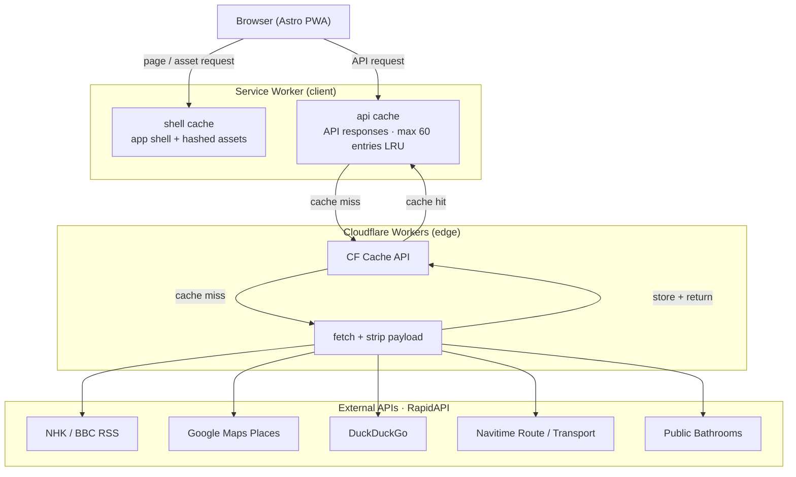
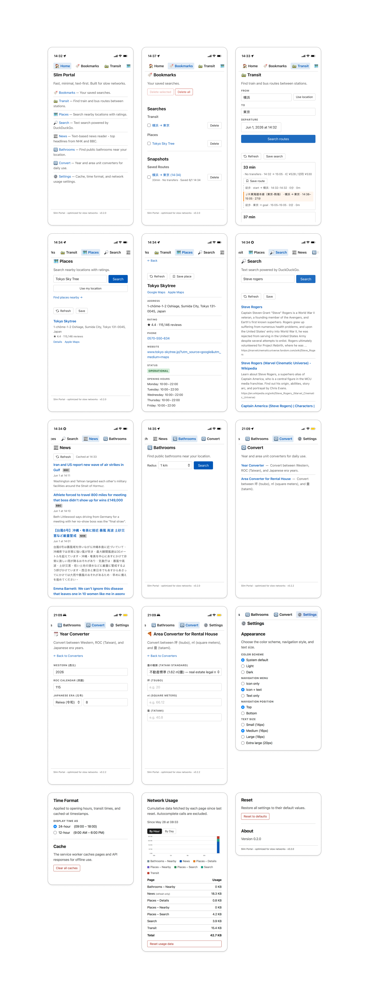

# slim-portal

A lightweight web portal designed for **slow mobile networks (128 kbps)**. Acts as a middle layer that fetches, strips, and serves only essential text-based content to the client.

**Target payload: < 55 KB per page view.**

## Features

- **News** — NHK + BBC RSS reader
- **Places** — Nearby location search with ratings (Google Maps)
- **Transit** — Japan transfer route lookup (Navitime)
- **Search** — Text search (DuckDuckGo)
- **Bathroom** — Public bathroom finder
- **Converters** — Japanese era year, area unit
- **Bookmarks** — Saved searches (localStorage)
- **Settings** — Theme, text size, menu style, network usage log

## Architecture



| Feature       | CF Cache TTL |
| ------------- | ------------ |
| News          | 15 min       |
| Place search  | 30 min       |
| Place details | 24 h         |
| Search        | 1 h          |
| Transit route | 1 h          |
| Transit nodes | 24 h         |
| Bathrooms     | 30 min       |

The Worker is the key layer: a raw Google Maps response can be 50–100 KB; after stripping it's under 2 KB. No API keys ever reach the browser.

## Stack

| Layer           | Choice                       |
| --------------- | ---------------------------- |
| Frontend        | Astro 6 (static, minimal JS) |
| Hosting         | Cloudflare Pages             |
| Edge functions  | Cloudflare Workers           |
| Caching         | CF Cache API                 |
| CSS             | Hand-written (no framework)  |
| PWA             | Vanilla service worker       |
| Package manager | Bun                          |
| Validation      | Zod 4                        |

## Design constraints

- No CSS frameworks, no web fonts, no images on data pages
- No client-side analytics or tracking
- All external API calls go through the Worker — never directly from the browser
- Pages must be readable without JavaScript

## Dev

```bash
bun install

bun run dev:web      # Astro frontend → localhost:4321
bun run dev:worker   # Cloudflare Worker → localhost:8787

bun run deploy:web
bun run deploy:worker
```

Set `RAPIDAPI_KEY` as a Worker secret via `wrangler secret put RAPIDAPI_KEY`.

Before using, subscribe to all five RapidAPI providers with the same key:

- [DuckDuckGo Search](https://rapidapi.com/Glavier/api/duckduckgo8)
- [Public Bathrooms](https://rapidapi.com/mnai01/api/public-bathrooms)
- [Navitime Route (TotalNavi)](https://rapidapi.com/navitimejapan-navitimejapan/api/navitime-route-totalnavi)
- [Navitime Transport](https://rapidapi.com/navitimejapan-navitimejapan/api/navitime-transport)
- [Google Map Places New V2](https://rapidapi.com/gmapplatform/api/google-map-places-new-v2)

## Screenshot


