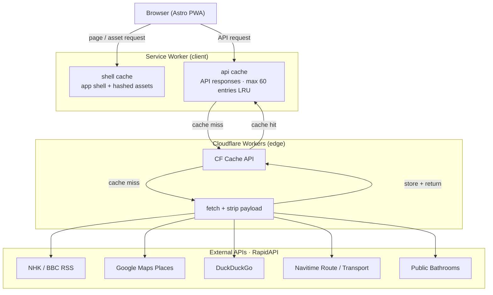

# slim-portal

A lightweight web portal designed for **slow mobile networks (128 kbps)**. Acts as a middle layer that fetches, strips, and serves only essential text-based content to the client.

**Target payload: < 55 KB per page view.**

## Features

- **News** — NHK + BBC RSS reader
- **Places** — Nearby location search with ratings (Google Maps)
- **Transit** — Japan transfer route lookup (Navitime)
- **Search** — Text search (DuckDuckGo)
- **Bathroom** — Public bathroom finder
- **Converters** — Japanese era year, area unit
- **Bookmarks** — Saved searches (localStorage)
- **Settings** — Theme, text size, menu style, network usage log

## Architecture



| Feature       | CF Cache TTL |
| ------------- | ------------ |
| News          | 15 min       |
| Place search  | 30 min       |
| Place details | 24 h         |
| Search        | 1 h          |
| Transit route | 1 h          |
| Transit nodes | 24 h         |
| Bathrooms     | 30 min       |

The Worker is the key layer: a raw Google Maps response can be 50–100 KB; after stripping it's under 2 KB. No API keys ever reach the browser.

## Stack

| Layer           | Choice                       |
| --------------- | ---------------------------- |
| Frontend        | Astro 6 (static, minimal JS) |
| Hosting         | Cloudflare Pages             |
| Edge functions  | Cloudflare Workers           |
| Caching         | CF Cache API                 |
| CSS             | Hand-written (no framework)  |
| PWA             | Vanilla service worker       |
| Package manager | Bun                          |
| Validation      | Zod 4                        |

## Design constraints

- No CSS frameworks, no web fonts, no images on data pages
- No client-side analytics or tracking
- All external API calls go through the Worker — never directly from the browser
- Pages must be readable without JavaScript

## Bundle Size

Measured from `bun run build:web` (Astro static build, `compressHTML: true`). Cloudflare Pages serves all text assets with gzip — the **gz total** column is the actual transfer cost per page.

**Shared assets** (same on every page)

| Asset             | Raw     | Gzip   |
| ----------------- | ------- | ------ |
| `_astro/Base.css` | 15.3 KB | 2.8 KB |
| `sw.js`           | 6.2 KB  | 1.6 KB |
| `manifest.json`   | 0.3 KB  | —      |

`_astro/util.settings.*.js` (76.4 KB raw / 21.2 KB gz) is the largest JS chunk. It's pulled in by every page that uses settings-aware features (all except `/`, `/converter*`, `/offline`, `/404`). The high raw size is misleading — it compresses to 21 KB and sits in the browser cache after first load.

**Per page** (HTML + shared CSS + all JS including transitive imports)

| Page                        | HTML   | JS      | Total raw | Total gz    |
| --------------------------- | ------ | ------- | --------- | ----------- |
| `/`                         | 5.2 KB | —       | 20.5 KB   | **4.6 KB**  |
| `/news`                     | 4.7 KB | 77.5 KB | 97.5 KB   | **26.9 KB** |
| `/search`                   | 5.1 KB | 80.3 KB | 100.7 KB  | **28.2 KB** |
| `/place`                    | 5.4 KB | 83.1 KB | 103.8 KB  | **29.2 KB** |
| `/place/nearby`             | 5.2 KB | 78.7 KB | 99.2 KB   | **27.6 KB** |
| `/place/detail`             | 4.8 KB | 82.2 KB | 102.3 KB  | **28.5 KB** |
| `/transit`                  | 6.0 KB | 85.2 KB | 106.5 KB  | **30.1 KB** |
| `/transit/detail`           | 4.2 KB | 80.2 KB | 99.7 KB   | **27.9 KB** |
| `/bathroom`                 | 5.3 KB | 78.9 KB | 99.4 KB   | **27.7 KB** |
| `/converter`                | 4.3 KB | —       | 19.6 KB   | **4.4 KB**  |
| `/converter/year-converter` | 5.2 KB | 1.9 KB  | 22.4 KB   | **5.7 KB**  |
| `/converter/area-converter` | 5.4 KB | 1.7 KB  | 22.4 KB   | **5.7 KB**  |
| `/bookmark`                 | 4.5 KB | 79.8 KB | 99.6 KB   | **27.3 KB** |
| `/settings`                 | 8.9 KB | 82.3 KB | 106.5 KB  | **29.3 KB** |
| `/offline`                  | 4.1 KB | —       | 19.4 KB   | **4.3 KB**  |
| `/404`                      | 4.1 KB | —       | 19.4 KB   | **4.3 KB**  |

CSS (15.3 KB raw / 2.8 KB gz) is excluded from the HTML and JS columns above but included in all totals. No images on data pages; `icons/icon.svg` (0.3 KB) is only fetched by the browser for PWA install.

## Dev

```bash
bun install

bun run dev:web      # Astro frontend → localhost:4321
bun run dev:worker   # Cloudflare Worker → localhost:8787

bun run deploy:web
bun run deploy:worker
```

Set `RAPIDAPI_KEY` as a Worker secret via `wrangler secret put RAPIDAPI_KEY`.

Before using, subscribe to all five RapidAPI providers with the same key:

- [DuckDuckGo Search](https://rapidapi.com/Glavier/api/duckduckgo8)
- [Public Bathrooms](https://rapidapi.com/mnai01/api/public-bathrooms)
- [Navitime Route (TotalNavi)](https://rapidapi.com/navitimejapan-navitimejapan/api/navitime-route-totalnavi)
- [Navitime Transport](https://rapidapi.com/navitimejapan-navitimejapan/api/navitime-transport)
- [Google Map Places New V2](https://rapidapi.com/gmapplatform/api/google-map-places-new-v2)
